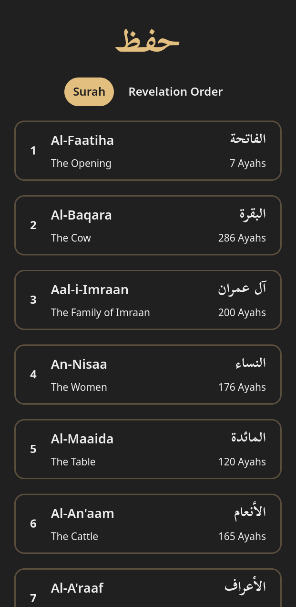

<a id="readme-top"></a>

# HIFZ AL KITAB (In Progress)

<details>
  <summary>Table of Contents</summary>
  <ol>
    <li>
      <a href="#about-the-project">About The Project</a>
      <ul>
        <li><a href="#built-with">Built With</a></li>
      </ul>
    </li>
    <li>
      <a href="#getting-started">Getting Started</a>
      <ul>
        <li><a href="#prerequisites">Prerequisites</a></li>
        <li><a href="#installation">Installation</a></li>
      </ul>
    </li>
    <li><a href="#acknowledgments">Acknowledgments</a></li>
  </ol>
</details>

## About The Project

<div align="center">
    
</div>

Offering more than just Quran text. It aids users with memorization of the Quran by revealing words on hover or complete ayahs on click. Also, providing recitation by famous Qari and full UI customization to the user.

Here's what makes it different: 

- Reveal words on hover/click
- UI customization available

<p align="right">(<a href="#readme-top">back to top</a>)</p>

### Built With

Following tools were used for building this project:

* [![Typescript][TS]][TS-url]
* [![Nextjs][Next]][Next-url]
* [![Tailwind][Tailwind]][Tailwind-url]


<p align="right">(<a href="#readme-top">back to top</a>)</p>

## Getting Started

To get a local copy up and running, then follow these simple steps.

### Prerequisites

* pnpm

### Installation

1. Clone the repo
   ```sh
   https://github.com/karimdevelops/hifz-alkitab/
   ```
3. Install packages
   ```sh
   pnpm install
   ```
4. Enter necessary variables in .env
    ```env
    CHAPTERS_API_URL="<API LINK>"
    CHAPTERS_REVEAL_API_URL="<API LINK>"
    SURAH_API_URL="<API LINK>"
   ```

5. Run the the project 
    ```sh
    pnpm run dev
    ```

<p align="right">(<a href="#readme-top">back to top</a>)</p>

## TODO
- Reveal entire ayah on click
- Recite audio

## Acknowledgments

* [Quran.com API](https://quran.com/developers) 
* [Misraj](https://misraj.ai/) 
* [Quranic Universal Library](https://github.com/TarteelAI/quranic-universal-library)
* [The Quran Project](https://github.com/The-Quran-Project/Quran-API)

<p align="right">(<a href="#readme-top">back to top</a>)</p>

[TS]: https://img.shields.io/badge/TypeScript-3178C6?logo=typescript&logoColor=fff 
[TS-url]: https://www.typescriptlang.org/
[Next]: https://img.shields.io/badge/Next.js-black?logo=next.js&logoColor=white
[Next-url]: https://nextjs.org/
[Tailwind]: https://img.shields.io/badge/Tailwind%20CSS-%2338B2AC.svg?logo=tailwind-css&logoColor=white
[Tailwind-url]: https://tailwindcss.com/
